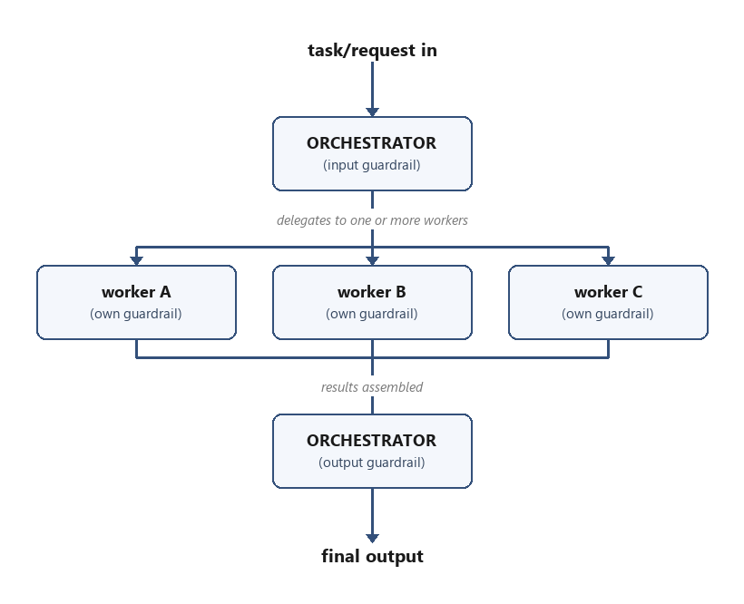
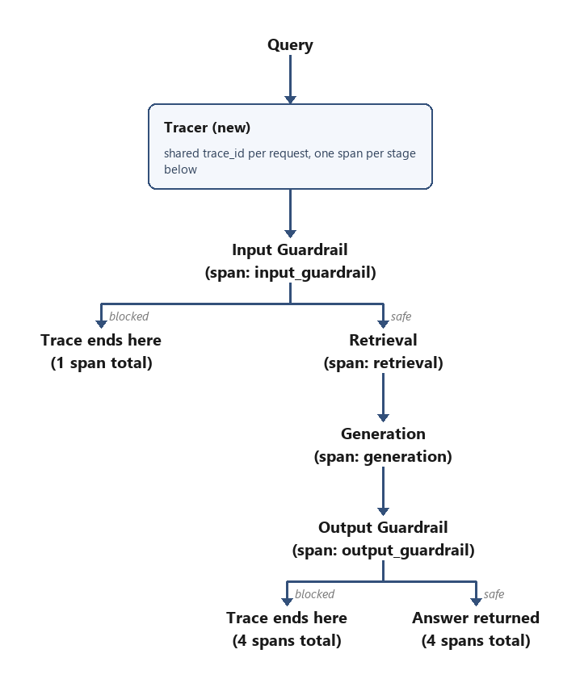
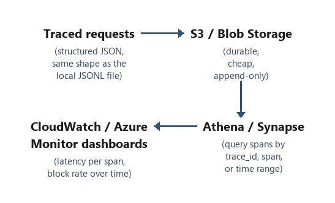
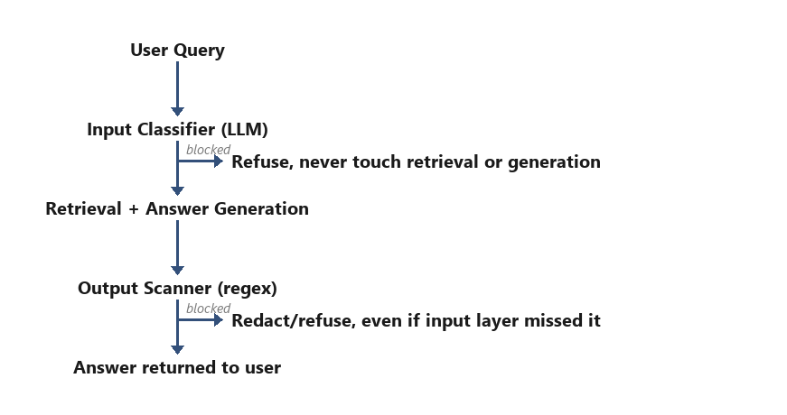

# text-to-png

A [Claude Code / Claude Skill](https://docs.claude.com/en/docs/claude-code/skills) with two related tools:

1. **Rasterize** text, code, terminal output, or ASCII art into a PNG exactly as typed, using a correctly-discovered monospace font.
2. **Redraw** an ASCII box-and-arrow diagram as a real flowchart — clean rounded boxes, real arrows, both fan-out/fan-in branching that reconverges and branches that don't (e.g. a guardrail that terminates one path while the other continues) — instead of just a screenshot of the ASCII.






## What it does

- Renders any text to a PNG with correct monospace alignment (important for ASCII art and terminal output, which break under proportional fonts).
- Auto-discovers a monospace font already installed on your system (Consolas/Courier on Windows, Menlo/Monaco on macOS, DejaVu/Liberation Mono on Linux) — no bundled font required.
- Ships with four color themes (`default`, `terminal`, `dark`, `amber`) plus fully custom `--fg`/`--bg` colors.
- Turns ASCII flowcharts/architecture diagrams into properly drawn diagrams (rounded boxes, wrapped bullet/paragraph text, branching arrows with side labels, horizontal pipelines including "snake" layouts that reverse direction), driven by a small JSON spec rather than a screenshot of the source characters.
- Auto-sizes every output image to fit its content exactly.

## Install

### As a Claude Skill

Download [`text-to-png.skill`](./text-to-png.skill) (or clone this repo) and either:
- drop the `.skill` file into Claude and click **Save skill**, or
- copy the `text-to-png/` folder into your `~/.claude/skills/` directory.

### Standalone (no Claude required)

Both tools are just Python scripts — you can use them directly:

```bash
pip install Pillow
python text-to-png/scripts/render_text_png.py --text "Hello, world!" --output hello.png
```

## Usage

### 1. Rasterizing text as-is (`render_text_png.py`)

```bash
# Plain text
python scripts/render_text_png.py --text "Hello, world!\nSecond line" --output out.png

# From a file (recommended for anything with meaningful whitespace, like ASCII art)
python scripts/render_text_png.py --file art.txt --output art.png

# Terminal theme with a custom font size
python scripts/render_text_png.py --file traceback.txt --output traceback.png --theme terminal --font-size 16

# Custom colors, transparent background
python scripts/render_text_png.py --text "BUILD PASSING" --fg "#00ff00" --bg "#000000" --output banner.png
```

| Flag | Description | Default |
|---|---|---|
| `--text` / `--file` | Text to render, or a path to a text file (mutually exclusive, one required) | — |
| `--output` | Output PNG path (required) | — |
| `--theme` | `default`, `terminal`, `dark`, or `amber` | `default` |
| `--fg`, `--bg` | Override theme colors (hex or CSS color name) | theme colors |
| `--font` | Path to a specific `.ttf`/`.ttc` font | auto-detected |
| `--font-size` | Font size in points | `20` |
| `--padding` | Padding in pixels around the text | `20` |
| `--line-spacing` | Line height multiplier | `1.0` |
| `--transparent` | Transparent background (ignores `--bg`) | off |

### 2. Redrawing an ASCII diagram as a flowchart (`render_flowchart.py`)

Takes a JSON description of the diagram's structure — not the raw ASCII — and draws it with real boxes and arrows, including fan-out/fan-in (several branches that reconverge on the same next step) and non-reconverging branches (some paths end, others keep going — e.g. a guardrail's blocked/safe split).

```bash
python scripts/render_flowchart.py --spec spec.json --output flowchart.png
# or inline:
python scripts/render_flowchart.py --spec-json '{"rows": [...]}' --output flowchart.png
```

Spec format:

```json
{
  "rows": [
    {"nodes": [{"type": "plain", "lines": ["New user message"]}]},
    {"nodes": [{"type": "box", "title": "Retrieval layer", "bullets": ["fact one", "fact two"]}]},
    {"label": "delegates to one or more workers", "nodes": [
        {"type": "box", "title": "worker A", "subtitle": "(own guardrail)"},
        {"type": "box", "title": "worker B", "subtitle": "(own guardrail)"}
    ]},
    {"label": "results assembled", "nodes": [{"type": "box", "title": "done"}]}
  ]
}
```

- Rows are drawn top to bottom, connected by arrows automatically.
- A row's `"label"` annotates the arrow(s) leading into it (for side-notes like "at end of session, not per turn").
- Multiple nodes in a row auto fan-out (if the previous row had one node) or fan-in (if the next row has one node) — for branches that reconverge on the same next step, like an orchestrator delegating to parallel workers.
- Node type `"plain"`: borderless text, either `"lines"` (list of strings, all bold — for short labels) or `"title"` + optional `"detail"` (bold title, smaller regular-weight description lines — for an unboxed step with explanatory subtext).
- Node type `"box"`: a rounded rectangle with a bold `"title"`, plus at most one of `"subtitle"` (one centered line), `"bullets"` (a wrapped, left-aligned list), or `"paragraph"` (a wrapped block of plain text, no bullet marker).
- **`"title"` can be a string or a list of strings** on either node type — match the source ASCII's own line-wrapping for long titles rather than joining it into one line, since an unexpectedly wide box shifts that node's connector anchor and can visibly misalign arrows to/from neighboring rows.

For branches that DON'T reconverge (a decision point where one path terminates and another continues on a different, longer path), use a `"branch"` entry instead — it must be the last entry in its `"rows"` list, and each branch's own `"rows"` follows the same rules recursively:

```json
{"type": "branch", "branches": [
    {"label": "blocked", "rows": [{"nodes": [{"type": "plain", "lines": ["Trace ends here"]}]}]},
    {"label": "safe", "rows": [
        {"nodes": [{"type": "plain", "lines": ["Retrieval"]}]},
        {"nodes": [{"type": "plain", "lines": ["Generation"]}]}
    ]}
]}
```

For diagrams that flow left-to-right instead of top-to-bottom (a pipeline: `A --> B --> C`), use `{"type": "hchain", "nodes": [...]}` as a row entry — nodes are laid out side by side with arrows between them. It still connects vertically to neighboring rows like any other row (incoming arrow lands on the flow-first node, outgoing arrow leaves the flow-last node). Add `"direction": "left"` to flow right-to-left instead, for "snake" layouts that reverse direction every row to stay compact — `"nodes"` stays in flow order either way, only the visual placement and arrowheads flip:

```json
{"type": "hchain", "nodes": [
    {"type": "plain", "title": "Traced requests", "detail": ["(structured JSON)"]},
    {"type": "plain", "title": "S3 / Blob Storage", "detail": ["(durable, append-only)"]}
]}
```

For guard-clause style branches — the main flow stays on one straight vertical line, and only the exceptional path tees off to the side (usually a "blocked"/error case), rather than the whole flow splitting into two columns — add `"side_exit"` to the row it leaves from instead of using `"branch"`. This keeps the main line centered even with several of these stacked in one diagram:

```json
{"nodes": [{"type": "plain", "lines": ["Input Classifier (LLM)"]}],
 "side_exit": {"label": "blocked", "node": {"type": "plain", "lines": ["Refuse, never touch retrieval or generation"]}}}
```

All four example images above were generated from this tool.

## License

MIT — see [LICENSE](./LICENSE).
